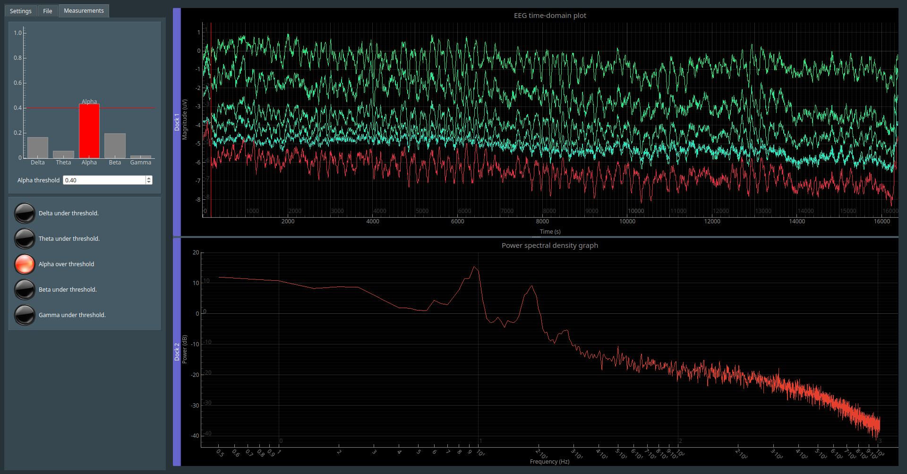

# Real-time BioSemi ActiView TCP client
This is a real-time Python interface designed to receive, plot, and emit signals based on incoming EEG data. This data is sourced from the TCP server included in BioSemi's ActiView client.

It can show up to 64 channels at 2048 Hz with relatively good performance, and display a PSD generated via Welch's method of the currently active channels.



Please note that this is a proof-of-concept, and should be used with caution. It is best used as an estimate for experiments, and should be accompanied with proper recording analysis afterwards (e.g. mne-python). Do note that the program does not make recordings on its' own, and I recommend using ActiView to record the signals separately.

# Installation

First, clone the repository:

```git clone https://github.com/Grimrist/biosemi_tcp_client.git```

Then, install all the packages included in requirements.txt. I recommend doing this in a virtual environment.

```pip install -r requirements.txt```

To run the program, simply run main.py from the root repository folder. This is necessary so that the icons are properly displayed.

```python ./src/main.py```

